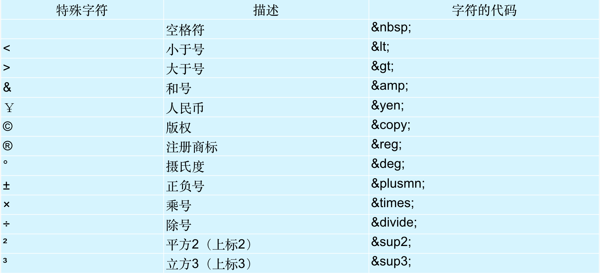

# 			尚观科技H5课程

## web前端简单介绍

web前端包含:pc端页面 和移动端页面(web端当前的就业形势)

认识网页
​	网页主要由文字、图片、超链接、输入框、表格、表单等元素构成，除了这些常见的元素之外，还有音频、视频、以及falsh等

**web标准**

1.w3c万维网联盟组织，用来指定web标准的机构。
2.web标准：制作网页要遵循的规范。
3.web标准规范的分类:结构标准   表现标准  行为标准
4.结构:html		表现:css 	行为:javascript

**结构标准:**相当于人的身体
**表现标准:**相当于人的衣服
**行为标准:**相当于人的动作

**浏览器**

浏览器是网页运行的平台，常用的浏览器有IE、火狐（Firefox）、谷歌（Chrome）、Safari和Opera等。

**所学课程大体介绍:**

课程一:	html语言   html就是用来制作网页的，h5是html的最新标准，其实也就是升级版的Html

课程二: css样式  css就是对网页进行美化的(也叫网页的美容师)

课程三: js 是一门松散的面向对象的语言，在网页中，它的作用就是让网页动起来，让网页具有生命力。

**html简介**

html (Hyper   Text    Markup   Language )   中文译为“超文本标记语言”，主要是通过html标记对网页中的文本，图片，声音等内容进行描述

HTML之所以称为超文本标记语言，不仅是因为他通过标记描述网页内容，同时也由于文本中包含了所谓的“超级链接”，通过超链接可以实现网页的跳转。从而构成了丰富多彩的Web页面。

**html基本文档格式:**

学习任何一门语言，都要首先掌握它的基本格式，就像写信需要符合书信的格式要求一样。HTML标记语言也不例外，同样需要遵从一定的规范。

```html
<!DOCTYPE html>
<html lang="en">
<head>
	<meta charset="UTF-8">
	<title>Document</title>
</head>
<body>
	
</body>
</html>
```

**标签解释:**

\<html>称为根标记，用于告知浏览器其自身是一个 HTML 文档，\<html>标记标志着HTML文档的开始，\</html>标记标志着HTML文档的结束，在他们之间的是文档的头部和主体内容。
\<html  lang="en">   向搜索引擎表示该页面是html语言，并且语言为英文网站，其"lang"的意思就是“language”，语言的意思，而“en”即表示english
这个主要是给搜索引擎看的，搜索引擎不会去判断该站点是中文站还是英文站，所以这句话就是让搜索引擎知道，你的站点是中文站，对html页面本身不会有影响

\<head>标记用于定义HTML文档的头部信息，也称为头部标记，紧跟在\<html>标记之后，主要用来封装其他位于文档头部的标记。
一个HTML文档只能含有一对\<head>标记，绝大多数文档头部包含的数据都不会真正作为内容显示在页面中。

\<title>标记用于定义HTML页面的标题，即给网页取一个名字，必须位于\<head>标记之内。一个HTML文档只能含有一对\<title>\</title>标记，\<title>\</title>之间的内容将显示在浏览器窗口的标题栏中。其基本语法格式如下：

```html
    <title>网页名称</title>
```

\<body>标记用于定义HTML文档所要显示的内容，也称为主体标记。浏览器中显示的所有文本、图像、音频和视频等信息都必须位于\<body>标记内，\<body>标记中的信息才是最终展示给用户看的。
一个HTML文档只能含有一对\<body>标记，且\<body>标记必须在\<html>标记内，位于\<head>头部标记之后.

**html标签关系**

1.嵌套关系
2.并列关系
嵌套关系：类似父亲和儿子之间的关系

```html
              <html>
                    <head></head>
                    <body></body>
             </html>
```
并列关系：类似与兄弟之间的关系
```html
                  <head></head>                
                   <body></body> 
```


**html标签分类**

双标记也称体标记，是指由开始和结束两个标记符组成的标记。其基本语法格式如下：

```html
   <标记名></标记名>
```
该语法中“<标记名>”表示该标记的作用开始，一般称为“开始标记（start tag）”，“</标记名>” 表示该标记的作用结束，一般称为“结束标记（end tag）”。和开始标记相比，结束标记只是在前面加了一个关闭符“/”。

单标记也称空标记，是指用一个标记符号即可完整地描述某个功能的标记。其基本语法格式如下：

```html
<标记名/>
```

**前端主流开发工具**
Dreamweaver  sublime  webStorm  等，目前主流的开发工具是sublime，所以在以后的课程中我们会使用sublime这个开发工具。、

**创建第一个网页**

**水平线标记**

在网页中常常看到一些水平线将段落与段落之间隔开，使得文档结构清晰，层次分明。这些水平线可以通过插入图片实现，也可以简单地通过标记来完成，\<hr />就是创建横跨网页水平线的标记。其基本语法格式如下：
\<hr />是单标记，在网页中输入一个\<hr />，就添加了一条默认样式的水平线。

**换行标记**

在HTML中，一个段落中的文字会从左到右依次排列，直到浏览器窗口的右端，然后自动换行。如果希望某段文本强制换行显示，就需要使用换行标记\<br />，这时如果还像在word中直接敲回车键换行就不起作用了。

**段落标记**

在网页中要把文字有条理地显示出来，离不开段落标记，就如同我们平常写文章一样，整个网页也可以分为若干个段落，而段落的标记就是\<p>。\<p>是HTML文档中最常见的标记，默认情况下，文本在一个段落中会根据浏览器窗口的大小自动换行。

**标题标记**

 为了使网页更具有语义化，我们经常会在页面中用到标题标记，HTML提供了6个等级的标题，即\<h1>、\<h2>、\<h3>、\<h4>、\<h5>和\<h6>，从\<h1>到\<h6>重要性递减。其基本语法格式如下：

```html
<hn>标题文本</hn>
```

**文本样式标记**

多种多样的文字效果可以使网页变得更加绚丽，为此HTML提供了文本样式标记\<font>，用来控制网页中文本的字体、字号和颜色。其基本语法格式如下：

```html
<font>文本内容</font> 
```

在网页中，有时需要为文字设置粗体、斜体或下划线效果，这时就需要用到HTML中的文本格式化标记，使文字以特殊的方式显示。

| 标记                            | 显示效果                       |
| ----------------------------- | -------------------------- |
| \<b>\</b>和\<strong>\</strong> | 文字以粗体方式显示（XHTML推荐使用strong） |
| \<i>\</i>和\<em>\</em>         | 文字以斜体方式显示（XHTML推荐使用em）     |
| \<s>\</s>和\<del>\</del>       | 文字以加删除线方式显示（XHTML推荐使用del）  |
| \<u>\</u>和\<ins>\</ins>       | 文字以加下划线方式显示（XHTML不赞成使用u）   |

在HTML中还有一种特殊的标记——注释标记。如果需要在HTML文档中添加一些便于阅读和理解但又不需要显示在页面中的注释文字，就需要使用注释标记。其基本语法格式如下：

```html
<!-- 注释语句 -->
```

注释内容不会显示在浏览器窗口中，但是作为HTML文档内容的一部分，也会被下载到用户的计算机上，查看源代码时就可以看到。

注释的作用及重要性比如:

```html
<!DOCTYPE html>
<html lang="en">
<!-- 这个公司没有年终奖，美女也不多，不要想着在这能拿年终奖或者泡个妹子。这个项目有很多意外的bug,早点闪人吧-!!!!!! -->
<head>
	<meta charset="UTF-8">
	<title>Document</title>
</head>
<body>

</body>
</html>
```


**其他常用标记**

```html
<br>   <!-- 换行 -->
<wbr>    <!-- br：在一个段落里面，加上这个标签之后，不论加在哪都能直接换行 -->
 HTML5<b>HTML5</b> <br>  <!-- 标记一段文字强调，实际意义为加粗 -->
 HTML5<strong>HTML5</strong> <br>    <!-- 给文本加粗 -->
 HTML5<i>HTML5</i> <br>    <!-- 倾斜标签 -->
 HTML5<em>HTML5</em>  <br>  <!--  倾斜，用法跟i一样 -->
 HTML5<code>HTML5</code> <br>   <!-- 表示计算机代码 -->
 HTML5<var>HTML5</var> <br>   <!-- 表示程序输出   -->
 HTML5<s>HTML5</s>   <br>  <!-- 删除线 -->
 HTML5<del>HTML5</del>    <br> <!-- 删除线 -->
 HTML5<u>HTML5</u> <br>     <!-- 下划线 -->
HTML5<ins>HTML5</ins>   <br>   <!-- 下划线 -->
HTML5<small>HTML5</small>  <br>    <!-- 添加小号字体 -->
HTML<sup>5</sup>  <br>    <!-- 上标 -->
HTML5<sub>5</sub>   <br>    <!-- 下标 -->
a<sup>2</sup>+b<sup>2</sup>=c<sup>2</sup>   <br>
HTML5<abbr>HTML5</abbr> <br>   <!-- 表示缩写 --> 
HTML5<dfn>HTML5</dfn>  <br>   <!-- 表示定义术语 -->
HTML5<q>HTML5</q> <br>    <!-- 表示引用他处的内容 -->
HTML5<cite>HTML5</cite> <br>   <!-- 引用其他作品的标题 -->
HTML5<bdo dir="rtl">HTML5</bdo>  <br>  <!-- 文字排序顺序
默认是ltr  如果想倒叙的话就设置成rtl --> 

<ruby>    <!-- 语言元素 -->
	饕 <rp><rp><rt>tao</rt></rp></rp>
	餮 <rp><rp><rt>tie</rt></rp></rp>
</ruby>  <br>

HTML5<mark>HTML5</mark>    <br>  <!-- 加一个标记，效果为背景变黄 -->

<time>2016/10/31</time>     <br>  <!-- 时间标签 -->
HTML5<span>HMTL5</span>   <br>  <!-- 表示一般性文本，没有实际作用 -->
```


图像标记\

HTML网页中任何元素的实现都要依靠HTML标记，要想在网页中显示图像就需要使用图像标记，接下来将详细介绍图像标记\以及和他相关的属性。其基本语法格式如下：

```html

```

\标记属性

| 属性     | 属性值  | 描述           |
| ------ | ---- | ------------ |
| src    | URL  | 图像的路径        |
| alt    | 文本   | 图像不能显示时的替换文件 |
| width  | 像素   | 图像的宽度        |
| height | 像素   | 图像的高度        |
| height | 像素   | 图像的高度        |

**路径**

相对路径:相对路径不带有盘符，通常是以HTML网页文件为起点，通过层级关系描述目标图像的位置。例如:

```html

```

相对路径设置分为以下三种：

1. 图像文件和html文件位于同一文件夹：只需输入图像文件的名称即可，如img src="logo.gif"。
2. 图像文件位于html文件的下一级文件夹：输入文件夹名和文件名，之间用“/”隔开，如img src="img/img01/logo.gif" /。
3. 图像文件位于html文件的上一级文件夹：在文件名之前加入“../” ，如果是上两级，则需要使用 “../ ../”，以此类推，如img src="../logo.gif"。

绝对路径: 绝对路径一般是指带有盘符的路径。指在一个电脑中根目录的位置。
首先是file:///开头，然后是磁盘符，然后是一个个的目录层次，找到相对应文件。这种方式有一个致命的问题，当整个目录转移到另外的盘符或者其他电脑时，目录结构一旦出现变化，就会失效

**创建超链接**

在HTML中创建超链接非常简单，只需用a/a标记环绕需要被链接的对象即可，其基本语法格式如下：

```html
<a href="跳转目标" target="目标窗口的弹出方式">文本或图像</a>
```

在上面的语法中，\<a>标记是一个行内标记，用于定义超链接，href和target为其常用属性，下面对它们进行具体地解释。

href：用于指定链接目标的url地址，当为\<a>标记应用href属性时，它就具有了超链接的功能。
target：用于指定链接页面的打开方式，其取值有_self和_blank两种，其中_self为默认值，_blank为在新窗口中打开方式。
注意:暂时没有确定链接目标时，通常将a标记的href属性值定义为"#"(href="#"),表示该链接暂时为一个空连接。

不仅可以创建文本超链接，在网页中各种网页元素，如图像、表格、音频、视频等都可以添加超链接。

**锚点链接**

通过创建锚点链接，用户能够快速定位到目标内容。
创建锚点链接分为两步：
使用“a href=”#id名“链接文本a创建链接文本。
使用相应的id名标注跳转目标的位置。


**特殊符号标记**



**列表**

1. 无序列表
   无序列表的各个列表项之间没有顺序级别之分，是并列的。其基本语法格式如下：

   ```html
   <ul>
   	<li></li>
   	<li></li>
   	<li></li>
   	<li></li>
   </ul>
   ```

   在上面的语法中，\<ul>\</ul>标记用于定义无序列表，\<li>\</li>标记嵌套在\<ul>\</ul>标记中，用于描述具体的列表项，每对\<ul>\</ul>中至少应包含一对\<li>\</li>。

   ​
   无序列表中type属性的常用值有三个，它们呈现的效果不同.
   默认值:disc
   方块:square
   空心圆:circle

2. 有序列表
   有序列表即为有排列顺序的列表，其各个列表项按照一定的顺序排列定义，有序列表的基本语法格式如下：

   ```html
   <ol>
   	<li></li>
   	<li></li>
   	<li></li>
   	<li></li>
   </ol>
   ```

   在上面的语法中，\<ol>\</ol>标记用于定义有序列表，\<li>\</li>为具体的列表项，和无序列表类似，每对\<ol>\</ol>中也至少应包含一对\<li>\</li>。

   有序列表其他属性  type   start

   ```html
     <ol  type=value1    start=value2>
   		<li></li>        
     </ol>
   ```

   value1表示有序列表项目符号的类型, value2表示项目开始的数值. start是编号开始的数字，如start=2则编号从2开始，如果从1开始可以省略，或是在\<li>标签中设定value＝"n"改变列表行项目的特定编号，例如\<li value="7">。type=用于编号的数字,字母等的类型，如type=a，则编号用英文字母。使用这些属性，把它们放在\<ol>或\<li>的的初始标签中。

   type值可取:  1  a  A  i I 

   ​

3. 自定义列表
   定义列表常用于对术语或名词进行解释和描述，定义列表的列表项前没有任何项目符号。其基本语法如下：

   ```html
   <dl>
   	<dt>段落一</dt>
   	<dd>段落一内容</dd>
   	<dd>段落一内容</dd>

   	<dt>段落二</dt>
   	<dd>段落二内容</dd>
   	<dd>段落二内容</dd>
   </dl>
   ```

4. pre表示其格式应被保留的内容

5. figure表示图片  figcaption表示figure元素的标题