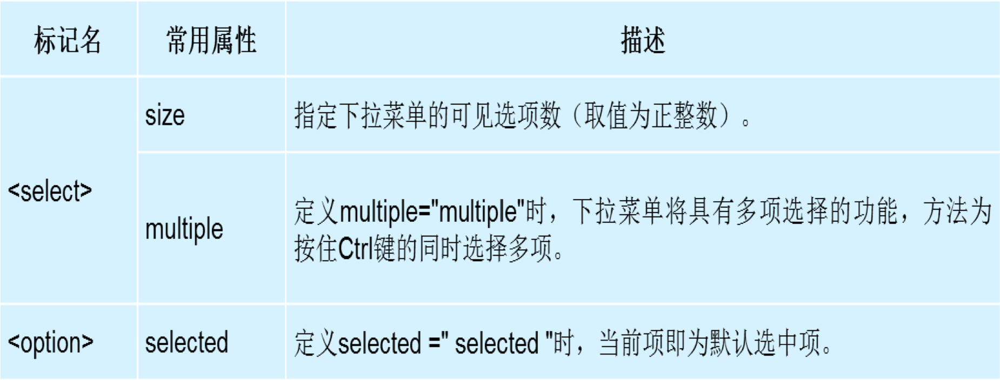

# 		尚观科技H5课程

[TOC]


## 上节课复习

html概念:hyper  Text    Markup  Language  (超文本标记语言)
Html标签分类：1双标签   2  单标签
Html标签之间的关系:    1  嵌套关系   2  并列关系
Html单标记：
横线标记 <hr>     换行标记<br>   
注释标记<!– 注释文本-->            ctrl+/
图片标记
Src属性:文件名称     alt属性:图片描述    title属性:鼠标移上                    去显示文字
相对路径     绝对路径

**html标记**
Html双标记
-标题标记 <hn></hn>    n 取值1-6
-段落标记<p></p>
-文字格式化标记:文字颜色大小字体(font),加粗，斜体，下划线，删除线

**超链接**
-超链接     <a href=“”  target=“_blank”></a>
Href:要跳转地址
Target:  默认值  _self  在当前页面打开新页面

**锚链接**:      定义<a   href=“#md”></a>

**特殊标记符号**

**列表** 有序 无需 自定义

##html表格

生活中会遇到哪些表格 （课程表,值日表…）
在HTML语言中，表格至少由<TABLE>标签、<TR>标签和<TD>标签这3对标签组成
表格的基本结构  :  列 行 单元格
1.<table>
<table>...</table>标签用于在HTML文档中创建表格。它包含表名和表格本身内容的代码。表格的基本单元是单元格，用<td>...</td>标签定义。
2.<tr>
表格行用<tr>标签定义，由单元格构成。多个行结合在一起就构成一个表格，这反映在用于创建表格的HTML语法中。表格的每一行都用<tr>标签表示，并用相应的</tr> 结束

3.<td>
表格的每一行又有若干表格单元格，用<td>...</td>标签表示。TD是"表格数据( Table Data)”的英文缩写。<td>标签定义一个列，嵌套于<tr>标签内。

border属性是最常用的属性，可用于定义表格的单元格和结构。该属性指定边框的厚度，如果其值设置为零(0)，则不显示边框。

**创建表格**

```html
<table>
	<tr>
		<td>单元格</td>
	</tr>
</table>
```

创建表格时，一般情况下分3步：
第一步：创建表格标签< table>…</table>。
第二步：在表格标签table>…</table>里创建行标签<tr>...</tr>，可以有多行。
第三步：在行标签<tr>...</tr>里创建单元格标签<td>...</td>，可以有多个单元格。

**表格的属性**

| 属性名         | 含义             | 常用属性值                |
| ----------- | -------------- | -------------------- |
| Border      | 设置边框 默认为0 没有边框 | 单位为px  像素值           |
| Cellspacing | 设置单元格与单元格之间的距离 | 单位为px 像素值            |
| Cellpadding | 设置文字与单元格之间的距离  | 默认1px                |
| Width       | 设置表格的宽度        | 单位px                 |
| Height      | 设置表格高度         | 单位px                 |
| Align       | 设置表格在网页中的对齐方式  | Left    right center |
| bgcolor     | 设置背景颜色         | 色值                   |

**caption 元素定义表格标题**

caption 标签必须紧随 table 标签之后。您只能对每个表格定义一个标题。通常这个标题会被居中于表格之上。

**<th>标记及其属性**

表头一般位于表格的第一行或第一列，其文本加粗居中，即为设置了表头的表格。设置表头非常简单，只需用表头标记<th></th>替代相应的单元格标记<td></td>即可。

**表格的结构**

在使用表格进行布局时，可以将表格划分为头部、主体和页脚，具体 如下所示：
<thead></thead>：用于定义表格的头部，必须位于<table></table>标记中，一般包含网页的logo和导航等头部信息。
<tfoot></ tfoot >：用于定义表格的页脚，位于<table></table>标记中<thead></thead>标记之后，一般包含网页底部的企业信息等。
<tbody></tbody>：用于定义表格的主体，位于<table></table>标记中<tfoot></ tfoot >标记之后，一般包含网页中除头部和底部之外的其他内容。

**合并单元格:**

要领:合并哪个单元格，在文档里直接删除就行

##html表单

-常见的表单：银行开户，学籍录入，网上注册信息等等
表单的作用：主要负责数据采集功能。
对于表单构成中的表单控件、提示信息和表单域，初学者可能比较难理解，对他们的具体解释如下：
表单控件：包含了具体的表单功能项，如单行文本输入框、密码输入框、复选框、提交按钮、重置按钮等。
提示信息：一个表单中通常还需要包含一些说明性的文字，提示用户进行填写和操作。
表单域：他相当于一个容器，用来容纳所有的表单控件和提示信息，可以通过他定义处理表单数据所用程序的url地址，以及数据提交到服务器的方法。如果不定义表单域，表单中的数据就无法传送到后台服务器。

表单语法:

```html
<form name="form_name" action="url" method="get|post">…</form>
```

Name ：定义表单的名称
Method: 定义表单结果从浏览器传送到服务器的方式，默认参数为：get ；
Action ：用来指定表单处理程序的位置(服务器端脚本处理程序）

**input控件**

```html
<input  type=“控件类型”>
```


**textarea控件**

如果需要输入大量的信息，就需要用到<textarea></textarea>标记。通过textarea控件可以轻松地创建多行文本输入框，其基本语法格式如下：

```html
<textarea cols="每行中的字符数" rows="显示的行数">
	文本内容
</textarea>
```

Cols:相当于宽度
Rows:相当于高度

**select控件**

在HTML中，要想制作下拉菜单，就需要使用select控件

```html
<select>
	<option></option>
	<option></option>
	<option></option>
	<option></option>
</select>
```

在HTML中，可以为<select>和<option>标记定义属性，以改变下拉菜单的外观显示效果，具体如下表所示。


**组合表单**
<fieldset> 标签没有必需的或唯一的属性
<legend> 标签为 fieldset 元素定义标题

练习


**标签语义化**

-标签语义化概念：根据内容的结构化（内容语义化），选择合适的标签（代码语义化）

**标签语义化意义：**
```html
   1:网页结构合理
   2:有利于seo:和搜索引擎建立良好沟通，有了良好的结构和语     	                   义你的网页内容自然容易被搜索引擎抓取；
   3:方便其他设备解析（如屏幕阅读器、盲人阅读器、移动设备）
   4:便于团队开发和维护
```
**标签语义化注意事项**

1：尽可能少的使用无语义的标签div和span；

2：在语义不明显时，既可以使用div或者p时，尽量用p, 因为p在默认情况下有上下间距，对兼容特殊终端有利；

3：不要使用纯样式标签，如：b、font、u等，改用css设置。

4：需要强调的文本，可以包含在strong或者em标签中strong默认样式是加粗（不要用b），em是斜体（不用i）；

**文档元素**


**嵌入元素**

1. map创建分区响应图

2. iframe嵌入另一个文档

   ```html
   <a href="index.html" target="in">index</a> |
   <a href="http://www.baidu.com" target="in">百度</a> <iframe src="http://www.ycku.com" width="600" height="500"
   name="in"></iframe>
   ```

3. progress显示进度

   ```html
   <progress value="30" max="100"></progress>
   //<progress>元素可以显示一个进度条，一般通过js控制内部的值
   ```

4. mete显示范围里的值

   ```html
   <meter value="90" min="10" max="100" low="40" high="80" optimum="60"></meter>
   //meter元素显示某个范围内的值，其下的属性包含:min和max表示范围边界，low表示小于它的值过低，high表示大于它的值过高，optimum表示最佳值，但是不出现效果
   ```

   ​

总结：

-认识表格及重要属性
-认识form表单标签，掌握其用法
标签语义化
meat标签 字符集