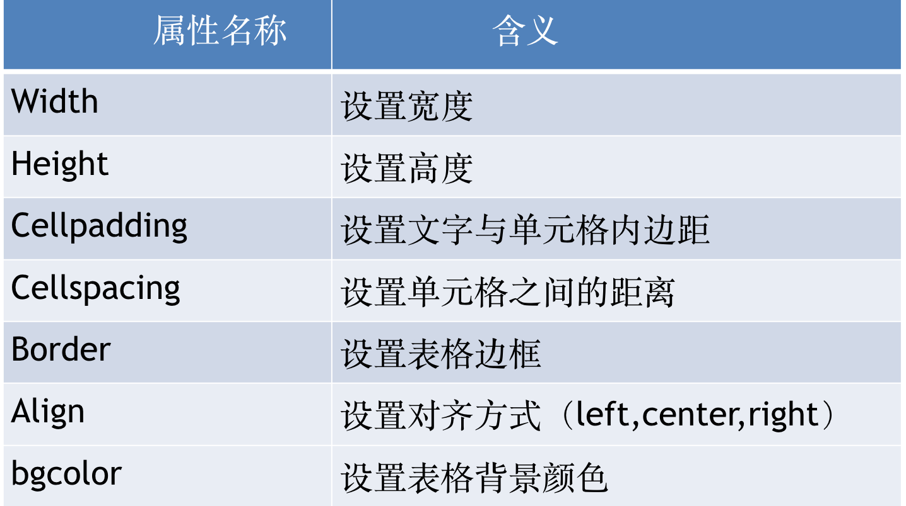
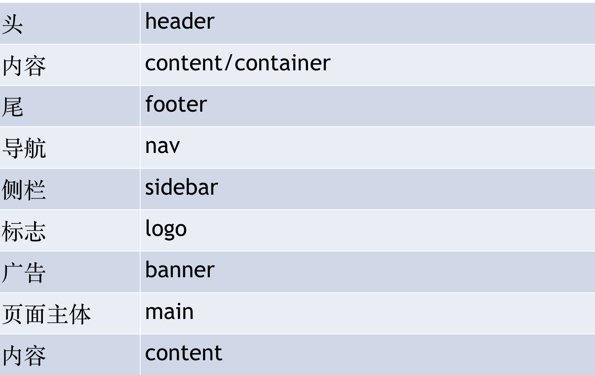
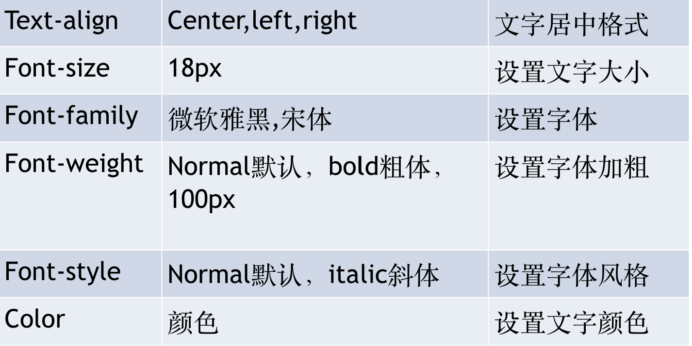

# 尚观科技H5课程

**复习**

1. table基本结构

   ```html
    <table>
          <thead></thead>  定义表格的表头
          <tbody></tbody>  定义表格的主体
          <tfoot></tfoot>      定义表格的结尾部分
      </table>
   ```

2. table的一些属性

   

   ​

3. 表单
   表单重要作用:采集数据信息
   表单语法格式:<form  method=“”   action=“”></form>

   ​

## CSS

**web的衰落**

​     在web早期（1990-1993）,html是一个很局限的语言。几乎完全由用于描述段落，超链接，列表和标题的结构化元素组成。随着万维网的出现（用户交互体验的加强），对html的要求越来越大，人们迫切需要html增加新的元素，去完成一个特定的功能。

​	迫于压力，html开始出现<font>，<i> , <s> 等标签。但是html是一种描述结构的语言，也开始描述外在表现了。几年之后这种随便的做法暴露出严重的问题：1：由于html既写结构又写样式，导致页面缺乏结构性，降低了网页的可访问性。2：页面维护越来越困难

​	当html中存斥着的表现标记问题，W3c并没有忽视。在1995年，w3c开始发布一种正在进行的计划（work-in-prrgress） 称之为css。

​	 与html相比，Css支持更丰富的文档外观，Css可以为任何元素的文本和背景设置颜色；允许在任何元素外围设置边框；允许改变文本的大小，装饰（如下划线），间隔，甚至可以确定是否显示文本。

**什么是CSS?**

CSS 指层叠样式表 (Cascading Style Sheets)

CSS通常称为CSS样式表或层叠样式表（级联样式表），主要用于设置HTML页面中的文本内容（字体、大小、对齐方式等）、图片的外形（宽高、边框样式、边距等）以及版面的布局等外观显示样式。

CSS以HTML为基础，提供了丰富的功能，如字体、颜色、背景的控制及整体排版等，而且还可以针对不同的浏览器设置不同的样式。

CSS就是控制页面布局和样式

**HTML和CSS的关系**

HTML 结构层 	负责从 语义的角度搭建页面结构
CSS 样式层	 负责从 审美的角度美化页
JavaScript 行为层 	 负责从 交互的角度提升用户体验

**语法结构:**
​	选择器{属性:值;属性:值;…….}

选择器：选择谁

参数说明：属性和属性值之间用冒号(:)隔开，定义多个属性时，属性之间用英文输入法下的分号;隔开。

**选择器：**   实现CSS对HTML页面样式的控制，如果要让这些样式对HTML页面中的元素实现一对一，一对多或者多对一的控制，这就需要用到CSS选择器，HTML页面中的元素就是通过CSS选择器进行控制的。

**选择器分类**

          1基础选择器                                                                 
                 1.1：标签选择器
                 1.2：类选择器
                 1.3：ID选择器
    			 1.4：复合选中器
         2复合选择器


**如何编写CSS样式**

​	内嵌（嵌入，内部）样式，head标签中添加style标签。

​	在head标签中添加style标签。
​	<head>
​		<style> p {color:red;}</style>
​	</head>

**标签选择器**
​	标签选择器其实就是html代码中的标签，Html中标签:<html>、<body>、<h1>、<p>、等等。

**CSS简单属性**

     width：设置宽度，单位px像素
     height：高度
     color：前景色，也就是文字的颜色
     background-color：背景色。
     font-size:字体的大小。
**练习**

​	设置p标签的背景色为红色
​	设置H1标签的字体颜色为绿色
​	设置span标签的文本为14像素

**类选择器**

什么是类？
​	物以类聚，人以群分。比如：我们都是牛人！
​	黄种人、白种人、欧洲人、亚洲人
​	所有的鸭子、所有的猫、

类选择器，是对HTML标签中class属性进行选择。CSS类选择器的选择符是 “.“类选择器在css样式编码中是最常用到的。

**使用方法：**
第一步：使用合适的标签把要修饰的内容标记起来，如下：
<span>Web开发</span>
第二步：使用class="类选择器名称"为标签设置一个类，如下：
<span class="one">Web开发</span>
第三步：设置类选器css样式，如下：
.one{color:red;}

**类选择器（class）多类选择器**
一个标签可以有多个类选择器的值，不同的值用空格分开，如：

```html
<div class="one yellow leftStyle">此处为标签内的文字</div>
```

**页面布局常见命名规范**



**命名：**

最好不用汉字，html标签去定义一个类名。   不能用数字开头 在名称内部可以出现特殊符号例如 ：下横线 _       中横线 -

**ID选择器**

ID选择器和类选择器用法一样，区别是同一个HTML页面中不能有相同的ID名称(使用多个相同的ID选择器，浏览器不会报错但是不符合W3C标准了，所以ID选择器命名必须要唯一性)

**语法格式**

```html
<head>
	<meta charset="UTF-8">
	<title>Document</title>
	<style type="text/css">
		#box{};
	</style>
</head>
<body>
<div id="box"></div>
	
</body>
```

**ID选择器与类选择器的区别**

1. 类选择器 ：  好比人的名字          刘德华     可以多人使用 
2. id 选择器     好比人的身份证     唯一性     有且只能使用一次
3. 不同于类选择器，ID 选择器不能结合使用

写样式的时候，大部分都是用类，极少的使用id。 不提倡用id 去写样式，因为他的权重太高。 Id 主要是为了 js 做准备。

**通配符选择器**

通配符选择器用“*”号表示，他是所有选择器中作用范围最广的，能匹配页面中所有的元素。例如下面的代码，使用通配符选择器定义CSS样式，设置所有HTML标记字体大小

```css
*{font-size:16px;}
```

**CSS相关属性**



字体合写语法格式:

```css
选择器{font:font-style font-weight font-size/line-height font-family}
```

注意:必须有  字体大小和字体   (font-size   和font-family),  必须严格按顺序写

```css
p{
      font: italic normal 20px 宋体;
  }
```

**复合选择器-标签指定式:**复合选择器是由两个或多个基础选择器，通过不同的方式组合而成的，具体如下

1. 标签指定式选择器（即....又....）,标签指定式选择器又称交集选择器，由两个选择器构成，其中第一个为标记选择器，第二个为class选择器或id选择器，两个选择器之间不能有空格，如 h3.special或p#one。表示指定标签下的选择器。

2. 后代选择器(包含选择器)，后代选择器用来选择元素或元素组的后代，其写法就是把外层标记写在前面，内层标记写在后面，中间用空格分隔。当标记发生嵌套时，内层标记就成为外层标记的后代。

3. 并集选择器，并集选择器是各个选择器通过逗号连接而成的，任何形式的选择器（包括标记选择器、class类选择器id选择器等），都可以作为并集选择器的一部分。如果某些选择器定义的样式完全相同，或部分相同，就可以利用并集选择器为它们定义相同的CSS样式。

   ​

**属性选择器**

```css
[href] {
	color:orange;
} /*属性选择器，直接通过两个中括号里面包含属性名即可*/

[type="password"] {
 	color:orange;
}/*匹配属性值的属性选择器*/

[href^="http"] {
  color:orange;
}/*属性值开头匹配的属性选择器*/

[href$=".com"] {
  color:orange;
}/* 属性值结尾匹配的属性选择器*/

[href*="baidu"]{
/* 属性值包含指定字符的属性选择器*/
}
```

**相邻兄弟选择器**

```css
p + b {
  color:red;
}/* 相邻兄弟选择器匹配和第一个元素相邻的第二个元素*/
```

**普通兄弟选择器**

```css
p~b {
 /*普通兄弟选择器匹配第一个元素后面的所有元素*/
}
```

**伪选择器**

伪选择器分为两种第一种是伪类选择器,还有一种就是伪元素选择器。这两种选择器特性上比较容易混淆,在 CSS3 中为了区分,伪元素前置两个冒号(::),伪类前置一个冒号(:)

**伪元素选择器**

```css
::first-line 块级首行
::first-letter块级首字母
::before文本前插入
::after 文本后插入

```

**伪类选择器**

```css
:root{}/*根元素选择器:匹配文档中的根元素，总是返回Html元素*/
ul>li:first-child {/*子元素选择器:选择第一个选择器*/
}
ul>li:last-child{};/*最后一个子元素*/
ul>li:only-child{};/*选择只有一个子元素的那个子元素*/
div>p:only-of-type{};/*选择只有一个指定类型的子元素的那个子元素*/
ul>li:nth-child(2){};/*选择子元素的第二个元素*/
ul>li:nth-last-child(2){};/*选择子元素倒数第二个元素*/
div>p:nth-of-type(2){};/*选择特定子元素的第二个元素*/

:enabled{};/*选择启用状态的元素*/
:disabled{};/*选择禁用状态的元素*/
:checked{};/*选择勾选的input元素*/
input:vlaid{}  input:invalid{};/*输入验证合法与不合法时选择的元素*/

a:link{}; /*表示未访问过的超链接*/
a:visited{};/*表示已经访问过的超链接*/
a:hover{};/*表示鼠标悬停在超链接上*/
a:active{};/*表示鼠标按下激活超链接时*/
input:focus{};/*表示获得焦点时*/

a:not([href*="baidu"]){};/*否定选择器，反选*/
:empty{};/*匹配没有任何内容的元素*/
```


**课后总结**

选择器分类
标签选择器语法及使用
类选择器语法及使用
ID选择器语法及使用
css复合选择器