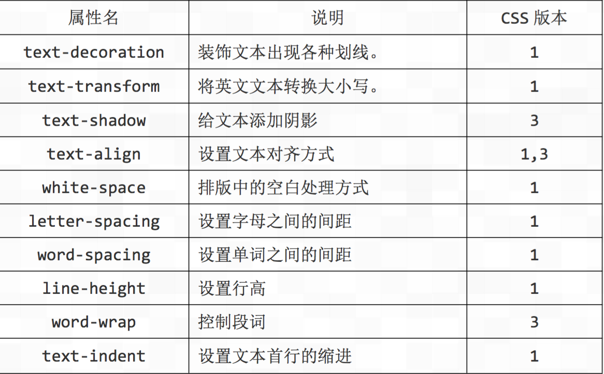

# 尚观科技H5课程

## 复习

**CSS:语法格式**
​	选择器{属性:值;属性:值;}

**CSS:书写位置**
​	<style>
​		选择器{属性:值;属性:值;}
​	</style>

**CSS:文字基本属性**

      corlor:文字颜色 
      font-style:文字格式       normal   字体正常     italic 文字斜体
      font-weight:文字粗体    normal    字体正常    bold  文字加粗=700
      font-size:文字大小    
      font-family :文字字体
**CSS:基础选择器**
​	 标签选择器,类选择器，ID选择器,通配符选择器
**CSS:复合选择器**
​	标签指定式选择器，后代选择器，并集选择器

标签指定式选择器:即....又的关系    
后代选择器：选择器中间用空格隔开
并集选择器：多个标签相同的样式集体申明

## CSS样式类型

1. 内联式

   ```html
   <p style="color:red"></p>  <!--作用当前行，不可以重用-->
   ```

2. 内嵌式

   ```css
   <style>
   	p{color:red}  //作用当前页，可实现重用
   </style>
   ```

3. 外联式

   ```html
   <link rel="stylesheet" type="text/css" href="box.css">
   作用整个网站，可以重用
   ```

**HTML标签元素的分类**
根基环境需求 人可以分为三种(黑白黄)

html标签根据现实模式不同，可以分为三类

1. 块级元素
2. 行内元素
3. 行内块元素

**什么是块级标签：**
在html中<div>、 <p>、<h1>、<form>、<ul> 和 <li>就是块级元素

**块级标签三特点：**

1. 一个块级元素独占一行
2. 元素的高度、宽度、行高以及顶和底边距都可设置
3. 元素宽度在不设置的情况下，是它本身父容器的100%

**行内元素：**
在html中<a>、<span>、<br>、<i>、<em>、<strong>、<label>等等属于行内元素

**行内元素三大特点：**

1. 和其他元素都在一行上
2. 元素的高度、宽度、行高及顶部和底部边距不可设置；
3. 元素的宽度就是它包含的文字或图片的宽度，不可改变（废话）

**行内块元素**
 html 中、<input>标签就是这种内联块状标签。

**行内块元素特点**
 	内联块状元素（inline-block）就是同时具备内联元素、块状元素的特点。

**显示模式互相转换**

将行内元素转换为块级元素 display:block;
将行内元素转换为行内块元素 display:inline-block 
display:inline转换为行内元素

**CSS层叠性和继承性**

1. 层叠性:所谓层叠性是指多种CSS样式的叠加。例如，当使用内嵌式CSS样式表定义<p>标记字号大小为12像素，链入式定义<p>标记颜色为红色，那么段落文本将显示为12像素红色，即这两种样式产生了叠加。
2. 继承性(子承父业):所谓继承性是指书写CSS样式表时，子标记会继承父标记的某些样式，如文本颜色和字号。想要设置一个可继承的属性，只需将它应用于父元素即可。


**样式继承:**如果某一个元素没有设置父元素相关的形式，那么就会使用继承机制将父元素的样式继承下来。比如:

```html
<p style="color:red;">这是<b>HTML5</b></p> <!--b元素继承了p元素的样式-->
```

样式继承只适用于元素的外观(文字，颜色，字体等)，而元素在页面上的布局不会被继承，如果继承这种样式，就必须使用强制继承:inherit

```html
<p>这是<b>HTML5</b></p>
```

```css
<style type="text/css">
p{
    border: 1px solid red;
 }
b{
	border : inherit;
} 
</style>
```

所有字相关的都可以继承，比如：color、text-系列、font-系列、line-系列、cursor,并不是所有的CSS属性都可以继承，例如，下面的属性就不具有继承性：边框、外边距、内边距、背景、定位、元素宽高属性。所有盒子相关的属性都不能继承。   a标签  h1 标签不会实现继承.

**CSS的优先级**

内联样式最大，内联样式的优先级最高。
ID选择器的优先级，仅次于内联样式。
类选择器优先级低于ID选择器
标签选择器低于类选择器。
总结:浏览器默认值<标签选择器<类选择器<ID选择器<行内式<!important

权重会叠加:定义CSS样式时，经常出现两个或更多规则应用在同一元素上，这时就会出现优先级的问题。
在考虑权重时，初学者还需要注意一些特殊的情况，具体如下：
继承样式的权重为0。即在嵌套结构中，不管父元素样式的权重多大，被子元素继承时，他的权重都为0，也就是说子元素定义的样式会覆盖继承来的样式。

行内样式优先。应用style属性的元素，其行内样式的权重非常高，可以理解为远大于100。总之，他拥有比上面提高的选择器都大的优先级。 

权重相同时，CSS遵循就近原则。也就是说靠近元素的样式具有最大的优先级，或者说排在最后的样式优先级最大。

所有都相同时，声明靠后的优先级大。

CSS定义了一个!important命令，该命令被赋予最大的优先级。也就是说不管权重如何以及样式位置的远近，!important都具有最大优先级。

内联(1000)+id(100)+class(10)+元素选择器(1)  权重计算

**背景background**

1. background-Color   背景颜色
2. background-image  背景图片
3. background-repeat  是否平铺，取值有
   repeat-x  repeat-y  repeat  no-repeat
4. background-position  背景的定位
5. background-size  背景大小
6. background-attachment  
   scroll  默认值，背景固定在元素上，不会随着内容一起滚动
   fixed  背景固定在视窗上，内容滚动时背景不动
7. 简写顺序  color  image  repeat  attachment position/size

**文本样式高级**

web字体：虽说可以通过备用字体来解决用户端字体缺失问题，但终究用户体验不好，且不一定备用字体所有用户都安装了，所以，css提供了web字体，也就是服务端字体

@font-face {
​	font-family:abc;
​	src:url('BrushScriptStd.otf');
}

p {
​	font-size:40px;
​	font-family:abc;
}


**文本总汇**



text-transform:
​	none:将已被转换大小写的值回复到默认状态
​	capitalize:将英文单词首字母大写
​	uppercase:将英文转换为大写字母
​	lowercase:将英文转换为小写字母

text-shadow:5px 5px 3px black;
​	第一个值代表水平偏移，第二个代表垂直偏移，第三个代表模糊度，第四个代表颜色