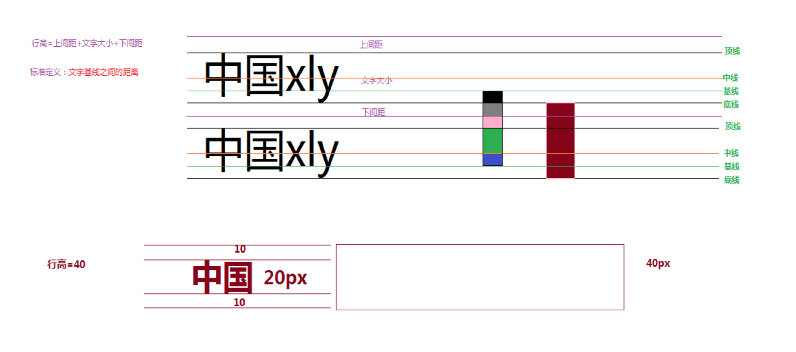
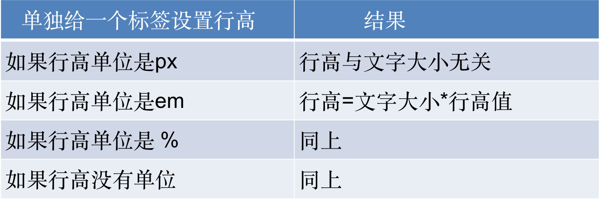
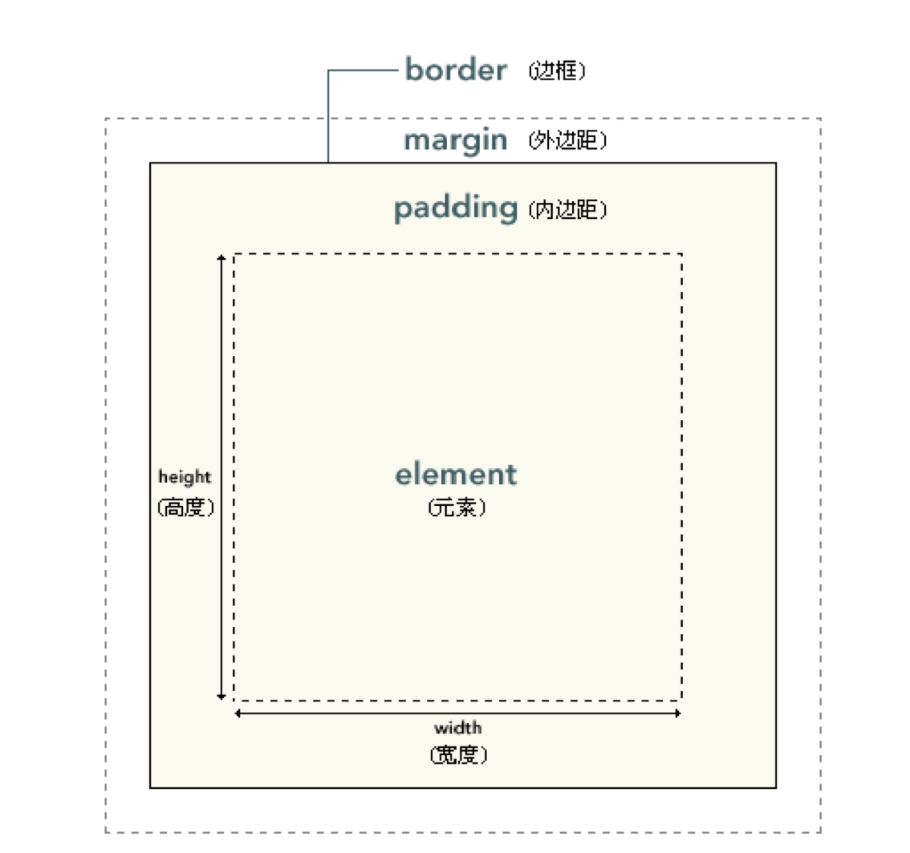
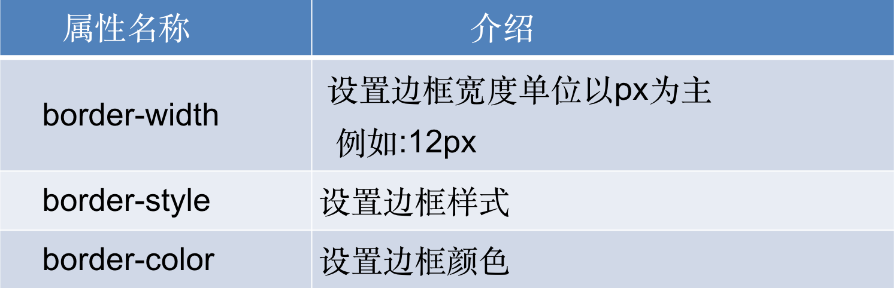
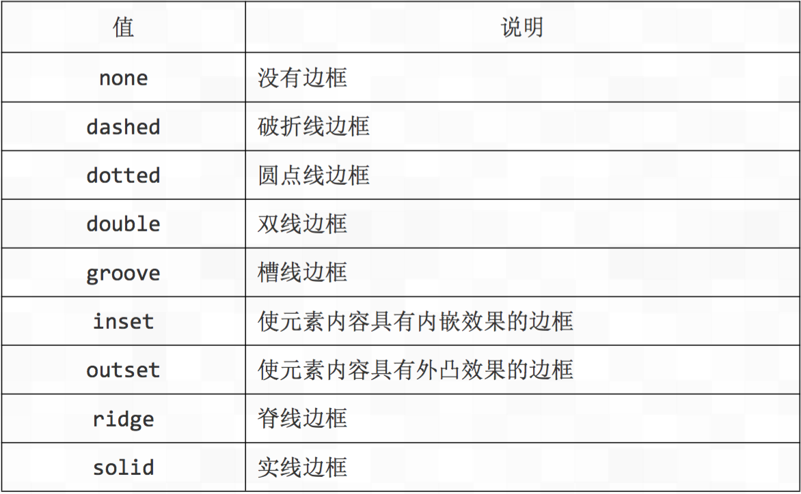
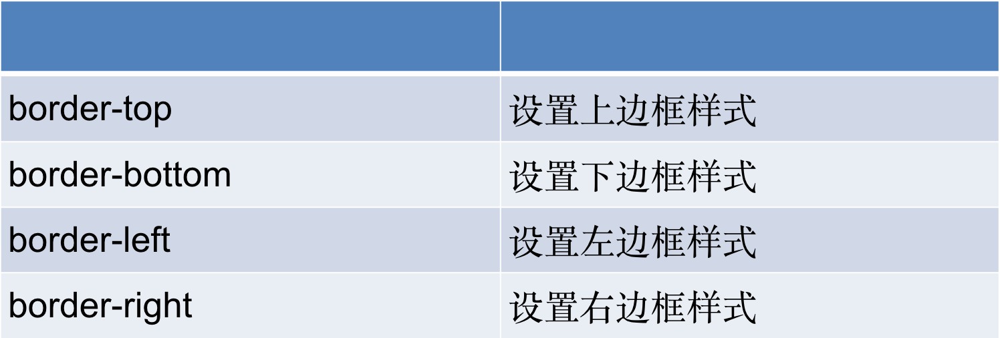
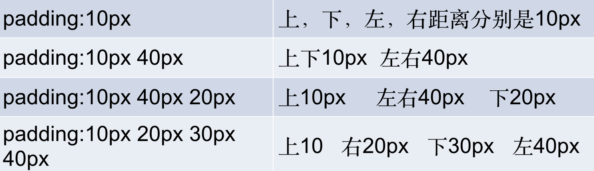
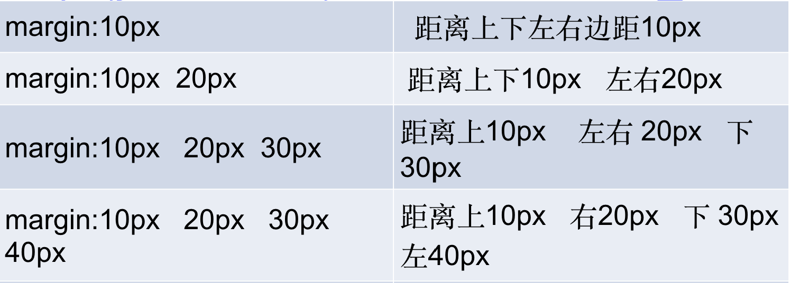
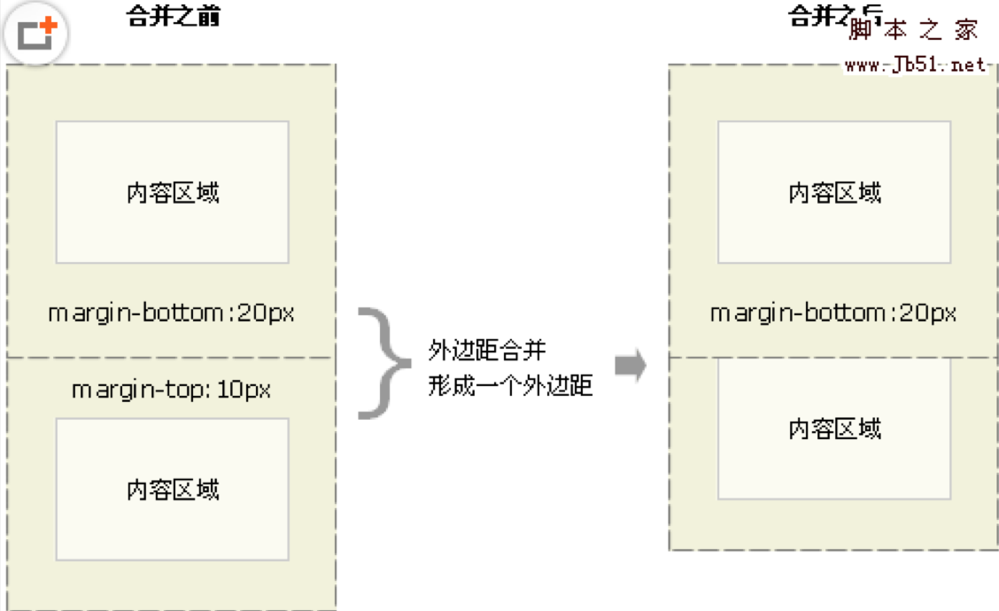

# 尚观科技H5课程

[TOC]

## 复习

1. css书写位置
   内嵌式
   外联式
   行内式
2. 三种样式各自的特点
   内嵌式:基本实现css代码与html代码分离。当前样式只能控制当前页面
   外链式:完全实现css代码与html代码分离，当前样式可以作用到整个网站
   行内式:完全没有实现css代码与html代码相分离，写法简答。维护成本高
3. css三大特性
   层叠性:浏览器解析CSS是从上至下，当CSS冲突时以最后定义的CSS为准。
   继承性:继承就是子标签继承了上级标签的CSS样式的属性
   css优先级:浏览器默认值<标签选择器<类选择器<ID选择器<行内式<!important
   优先级特点:权重会叠加   继承的权重为0
4. 标签分类
   html标签分类的依据：按照标签的显示模式分类
   块元素:1：独自占一行（霸道） 2：可是设置宽高   3：子元素默认宽度与父容器宽度一致
   行内元素:1：所有元素同在一行  2：不能设置宽高 3：元素的宽度就是包含的文字的宽度和高度
   行内快元素:1：所有元素同在一行  2：可以设置宽高
   元素之间的相互转化
5. 背景(background)

## css行高(line-height)

浏览器默认字体:16px
浏览器默认行高:18px
行高=上间距+文字大小+下间距

### 文字垂直居中

### 行高单位

## 盒模型

### 盒模型的概念

所谓盒子模型就是把HTML页面中的元素看作是一个矩形的盒子，也就是一个盛装内容的容器。每个矩形都由元素的内容、内边距（padding）、边框（border）和外边距（margin）组成。

css中盒子模型由三部分组成: 1边框（border） 2 内边距（padding） 3外边距（margin），如图:

### 盒模型之边框(border)

border复合属性的写法，与字体，背景一样联写一样

style样式取值

### border属性其他写法

border-collapse:collapse      设置表格边框合并（适用于表格）(制作细线表格)

### 盒模型之内边距（padding）

padding影响盒子大小,盒子宽度=盒子宽度+左右内边距+边框宽度

练习1:  提问：一个盒子宽度200px,文字距离盒子内左边距离40px,边框为3px,当前盒子最后的宽度是多大？

练习2:提问：文字距离盒子内左边距离40px,边框为3px,当前盒子宽度怎么设置最后能保证盒子最终宽度是200px?

### 盒子模型之外边距（margin）

用法与padding一样，margin对盒子宽度不会有影响

### 外边距合并

外边距合并（叠加）是一个相当简单的概念。
简单地说，外边距合并指的是，当两个垂直外边距相遇时，它们将形成一个外边距。合并后的外边距的高度等于两个发生合并的外边距的高度中的较大者。
当一个元素出现在另一个元素上面时，第一个元素的下外边距与第二个元素的上外边距会发生合并。

### 注意

行内元素不要给上下的margin 和padding
上下margin和padding会被忽略。
左右margin和padding会起作用。

