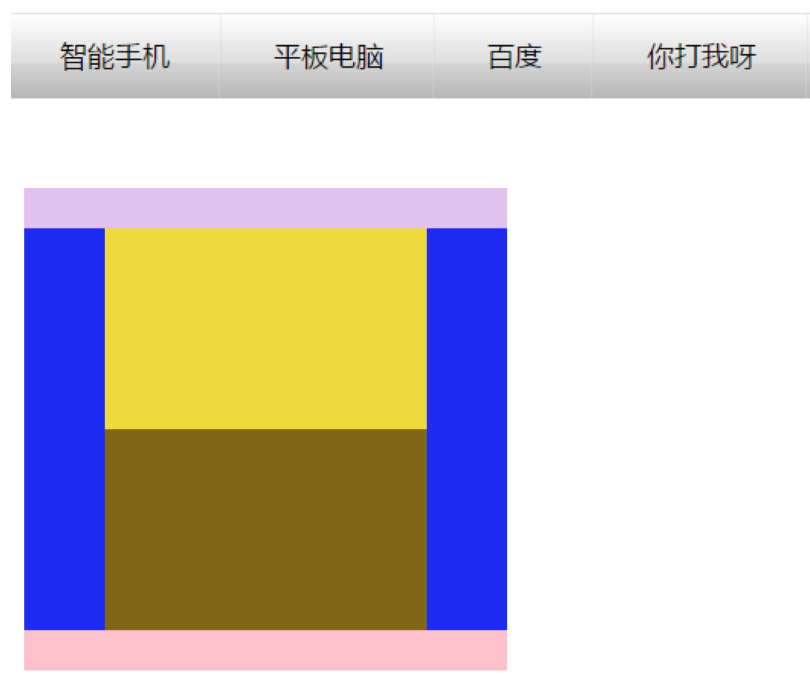
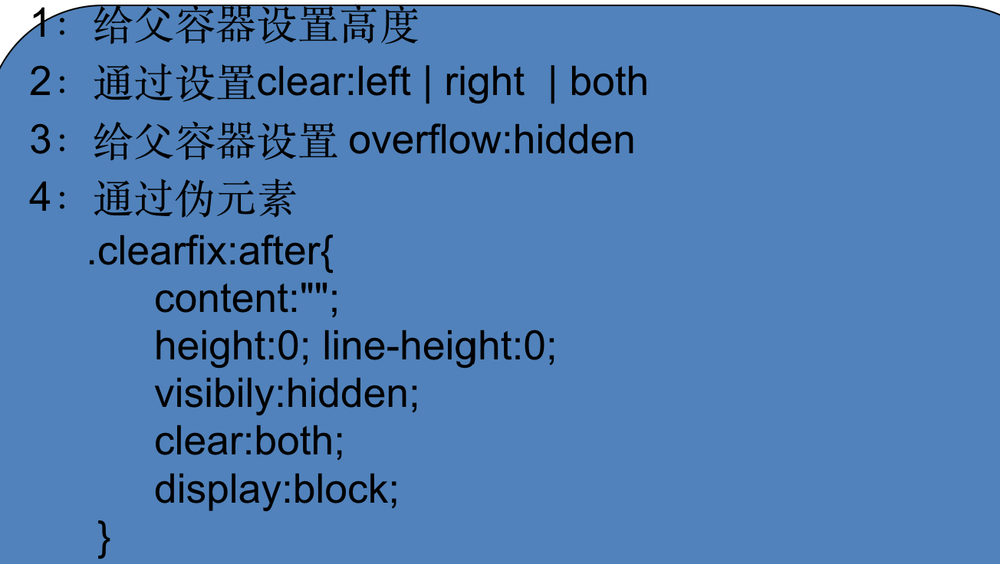
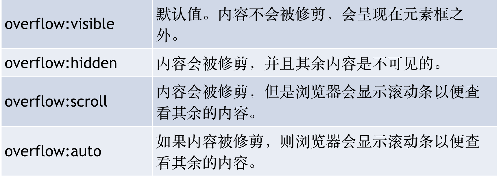
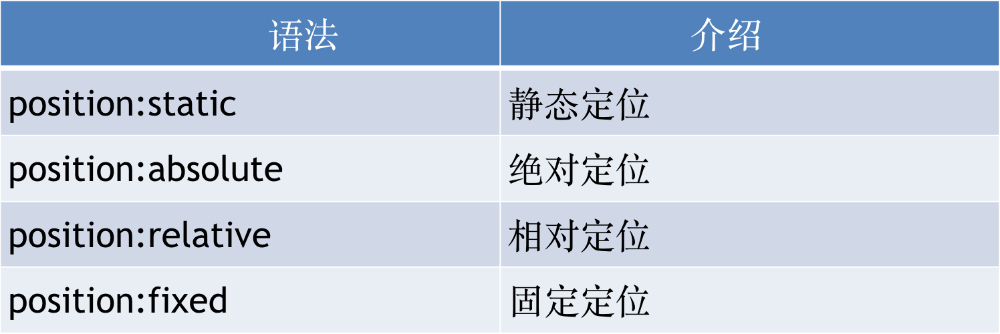

# 尚观科技H5课程

[TOC]

## 复习

### 行高

1. 可继承性
2. 文字垂直居中
3. 单位赋值

### 盒子模型

1. 盒子模型组成
2. border边框属性
3. padding内边距属性
4. 内边距对宽度影响
5. margin外边距属性
6. 外边距合并问题及解决

## 标准流normal flow(文档流)

标准流：块级元素纵向有序排列，行内块（行内）元素横向有序排列

默认情况下，块级元素纵向有序排列，行内块元素默认横向有序排列

怎么让div横向排列？？？？

### 浮动

语法：float:left  |  right
设置了浮动的元素，脱离标准流（脱标）

####浮动特点

1：浮动找浮动，不浮动找不浮动
2：浮动只影响后面的元素
3：浮动以元素顶部为基准对齐
4：浮动可是实现模式转换（span 设置浮动可以设置宽高）
5：让块级元素在一行显示

#### 浮动作用

1: 制作导航栏
2: 网页布局

浮动案例制作:

#### 清除浮动

当父容器没有设置高度，里面的盒子没有设置浮动的情况下会将父容器的高度撑开。一旦父容器中的盒子设置浮动，脱离标准文档流，父容器立马没有高度，下面的盒子会跑到浮动的盒子下面。出现这种情况，我们需要清除浮动

清除浮动的方式

### overflow介绍

overflow 属性规定当内容溢出元素框时发生的事情。

## 定位

### 定位分类

#### 静态定位

静态定位：就是按照标准流的方式显示（so   easy!）

#### 绝对定位

1：绝对定位以浏览器左上角为基准设置位置
2：当一个盒子包含在另一个盒子中，父盒子未设置定位，子盒子以浏览器左上角为基准设置位置； 当父盒子设置定位，子盒子以父盒子左上角为基准设置位置
3：绝对定位绝对不占空间位置（与浮动一样）
4：绝对定位可是实现模式转换

#### 相对定位

1：相对定位以元素自身的位置为基准设置位置

2：相对定位占位置

3：一般子元素设置相对定位，父元素设置绝对定位（子绝父相）

#### 固定定位

固定定位不占位置，

