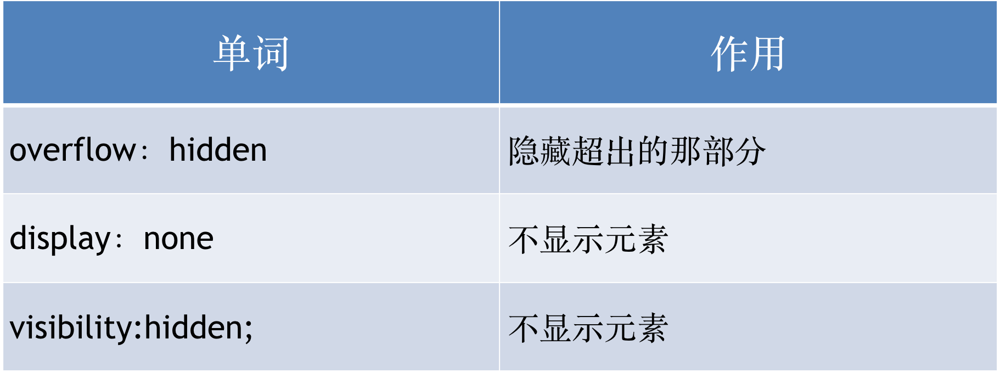

# 尚观科技前端课程

[TOC]

## CSS标签包含规范及一些属性

1. 行内元素尽量里面包含行内元素，不推荐:   <a href=”#”>   <h2> 标题 </h2 ></a>
2. 有些块级元素不能包含其他块级元素，标题标签，段落标签不能包含div，尤其是P标签不能包含div

### 规避脱标流

由于浮动，定位都脱离了标准流，会对网页布局造成一定的影响，在以后的网页布局中优先考虑：标准流，浮动，定位

### CSS可见性

特点总结:

1. display:none        元素隐藏不占位置
2. overflow:hidden;  将超出部分的元素隐藏
3. visibility:hidden;    元素隐藏占位置

## 精灵图

### 由来:

当用户访问一个网站时，需要向服务器发送请求，网页上的每张图像都要经过一次请求才能展现给用户。然而，一个网页中往往会应用很多小的背景图像作为修饰，当网页中的图像过多时，服务器就会频繁地接受和发送请求，这将大大降低页面的加载速度。为了有效地减少服务器接受和发送请求的次数，提高页面的加载速度，出现了CSS精灵技术（也称CSS Sprites）

简单地说，CSS精灵是一种处理网页背景图像的方式。它将一个页面涉及到的所有零星背景图像都集中到一张大图中去，然后将大图应用于网页，这样，当用户访问该页面时，只需向服务发送一次请求，网页中的背景图像即可全部展示出来。通常情况下，这个由很多小的背景图像合成的大图被称为精灵图，如下图所示为淘宝网站中的一个精灵图。

### 工作原理

CSS 精灵其实是将网页中的一些背景图像整合到一张大图中（精灵图）。然而，各个网页元素通常只需要精灵图中不同位置的某个小图，要想精确定位到精灵图中的某个小图，就需要使用CSS的background-image、background-repeat和background-position属性进行背景定位，其中最关键的是使用background-position属性精确地定位。

### 用法

1.精灵图只能用打开的方式，不能使用导入的方式打开

2.使用精灵图的时候注意坐标位置的正负取值

## 滑动门效果

## 项目练习