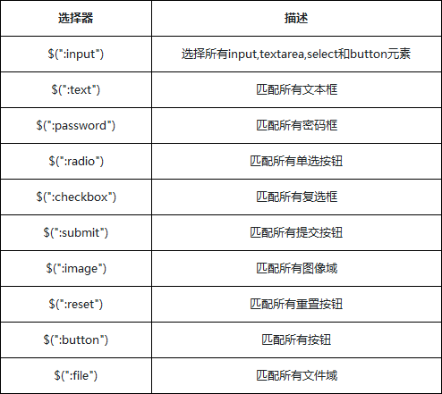

# jQuery

1. 什么是jQuery?
2. 如何获取jQuery对象
3. jQuery基本操作语法


**回顾js写代码的一些问题**

1. window.onload事件有个事件覆盖的问题，我们只能写一个。
2. 代码容错性差(只要有错误就会报错，比如id设置错误)
3. 浏览器兼容性问题
4. 书写很繁琐，代码多
5. 代码很乱，各个页面到处都是
6. 动画效果虽然简单但是实现起来有难度

**jQuery解决问题**

1. 解决了上述所有的问题

**jQuery的基本使用:**

jQuery的两个文件:min代表被压缩过的文件。区别:开发过程中，会用未压缩版本或者压缩的都可以，项目上线的时候，要用压缩后的版本。

1. 引包:要把jQuery文件放到项目里面
2. 引用:在页面中引用jQuery

**入口函数**

第一种方式:

```javascript
$(document).ready(function(){
});
```

第二种方式:是第一种方式的简写

```javascript
$(function(){
});
```

**事件处理程序**

1. 事件源

   ```javascript
   document.getElementById("id");
   $("#id");
   ```

2. 事件

   ```javascript
   document.getElementById("id").onclick
   $("#id").click
   //jQuery的事件不带on 
   ```

3. 事件处理程序

   ```javascript
   document.getElementById("id").onclick=function(){
   	//内容
   }
   $("#id").click(function(){
     //内容
   })
   ```

   ​

**练习:隐藏**

```javascript
$(document).ready(function(){
			$("#box").click(function(){//按钮点击事件
				$("#pox").hide();//隐藏盒子
			});
	});
```

**jQuery详细介绍**

1. js命名规范:下划线，字母，$，数字，但是不能以数字开头
2. jQuery有两种表示方式  $   jQuery,两者是等价的
3. jQuery占用了两个变量，$和jQuery

jQuery是轻量级的JavaScript库，核心依然是JavaScript，不仅兼容了CSS3,还兼容各种浏览器。

jQuery优势:

1. 容易上手
2. 强大的选择器
3. 完善的事件机制
4. 出色的Ajax封装
5. 丰富的UI

jQuery环境搭建

​	jQuery是一个JavaScript脚本库，不需要特别的安装，只需要我们在页面<head>标签中，通过<script>标签引入jQuery库即可。

引入方式有两种:

1. 下载jQuery库，直接用script标签引入,如:

   ```javascript
   <script type="text/javascript" src="jquery-3.1.1.js"></script>
   ```

   ​

2. 通过超链接访问服务器上的jQuery地址,通过 CDN（内容分发网络） 引用它，如:

   ```javascript
   <script type="text/javascript" src="http://ajax.microsoft.com/ajax/jquery
   /jquery-3.1.1.js"></script>
   ```

安装jQuery时，有两个版本的jQuery可供下载使用:

Production version - 用于实际的网站中，已被精简和压缩。
Development version - 用于测试和开发（未压缩，是可读的代码）

**$(document).ready**
$(document).ready 的作用是等页面的文档（document）中的节点都加载完毕后，再执行后续的代码，因为我们在执行代码的时候，可能会依赖页面的某一个元素，我们要确保这个元素真正的的被加载完毕后才能正确的使用。

```javascript
$(document).ready(function() {
});

```

**jQuery对象与DOM对象**:jQuery对象与DOM对象是不一样的

**区别**

1. 通过jQuery方法包装后的对象，是一个类数组对象。它与DOM对象完全不同，唯一相似的是它们都能操作DOM。
2. 通过jQuery处理DOM的操作，可以让开发者更专注业务逻辑的开发，而不需要我们具体知道哪个DOM节点有那些方法，也不需要关心不同浏览器的兼容性问题，我们通过jQuery提供的API进行开发，代码也会更加精短。

例如:

```html
<p id="box"></p>
```

JavaScript的处理方式

```javascript
var p = document.getElementById('box');
p.innerHTML = 'hello uplooking';
p.style.color = 'red';
```

jQuery的处理方式

```javascript
var $p = $('#box');
$p.html('hello uplooking').css('color','red');
```

通过$('#box')方法会得到一个$p的jQuery对象，$p是一个类数组对象。这个对象里面包含了DOM对象的信息，然后封装了很多操作方法，调用自己的方法html与css，得到的效果与标准的JavaScript处理结果是一致的。

 总结: jQuery库本质上还是JavaScript代码，它只是对JavaScript语言进行包装处理，为的是提供更好更方便快捷的DOM处理与开发中经常使用的功能。我们使用jQuery的同时也能混合JavaScript原生代码一起使用。在很多场景中，我们需要jQuery与DOM能够相互的转换，它们都是可以操作的DOM元素，jQuery是一个类数组对象，而DOM对象就是一个单独的DOM元素。

**如何把jQuery对象转成DOM对象**

1. 利用数组下标的方式读取到jQuery中的DOM对象
   html代码:

   ```html
   <div>元素一</div>
   <div>元素二</div>
   <div>元素三</div>
   ```

   JavaScript代码:

   ```javascript
   var $div = $('div') //jQuery对象
   var div = $div[0] //转化成DOM对象
   div.style.color = 'red' //操作dom对象的属性
   ```

2. 通过jQuery自带的get()方法:Query对象自身提供一个.get() 方法允许我们直接访问jQuery对象中相关的DOM节点，get方法中提供一个元素的索引：

   ```javascript
   var div = $div.get(0) //通过get方法，转化成DOM对象
   div.style.color = 'red' //操作dom对象的属性
   ```

   get方法其实就是利用的第一种方式处理的，只是包装成一个get让开发者更直接方便的使用。

**如何把DOM对象转化成jQuery对象？**
相比较jQuery转化成DOM，开发中更多的情况是把一个dom对象加工成jQuery对象。$(参数)是一个多功能的方法，通过传递不同的参数而产生不同的作用。如果传递给$(DOM)函数的参数是一个DOM对象，jQuery方法会把这个DOM对象给包装成一个新的jQuery对象。

html代码:

```html
<div>元素一</div>
<div>元素二</div>
<div>元素三</div>
```

JavaScript代码

```javascript
var div = document.getElementsByTagName('div'); //dom对象
var $div = $(div); //jQuery对象
var $first = $div.first(); //找到第一个div元素
$first.css('color', 'red'); //给第一个元素设置颜色
```

通过getElementsByTagName获取到所有div节点的元素，结果是一个dom集合对象，不过这个对象是一个数组集合(3个div元素)。通过$(div)方法转化成jQuery对象，通过调用jQuery对象中的first与css方法查找第一个元素并且改变其颜色。

## jQuery选择器之id选择器

页面的任何操作都需要节点的支撑，开发者如何快速高效的找到指定的节点也是前端开发中的一个重点。jQuery提供了一系列的选择器帮助开发者达到这一目的，让开发者可以更少的处理复杂选择过程与性能优化，更多专注业务逻辑的编写,jQuery几乎支持主流的css1~css3选择器的写法。


**id选择器：一个用来查找的ID，即元素的id属性**

```javascript
$( "#id" )
```

id选择器也是基本的选择器，jQuery内部使用JavaScript函数document.getElementById()来处理ID的获取。原生语法的支持总是非常高效的，所以在操作DOM的获取上，如果能采用id的话尽然考虑用这个选择器

注意:**id是唯一的，每个id值在一个页面中只能使用一次。如果多个元素分配了相同的id，将只匹配该id选择集合的第一个DOM元素。但这种行为不应该发生;有超过一个元素的页面使用相同的id是无效的**

**类选择器(class)**:类选择器，顾名思义，通过class样式类名来获取节点

```javascript
$( ".class" )
```

类选择器，相对id选择器来说，效率相对会低一点，但是优势就是可以多选。
JavaScript代码

```javascript
		//通过原生方法处理
        //样式是可以多选的，所以得到的是一个合集
        //需要通过循环给合集中每一个元素修改样式
        var divs = document.getElementsByClassName('box');
        for (var i = 0; i < divs.length; i++) {
            divs[i].style.border = "3px solid blue";
        }
```

jQuery代码:

```javascript
		//通过jQuery直接传入class
        //class选择器可以选择多个元素
        $(".box").css("border", "3px solid red");
		$(".box").eq(1).css("border", "3px solid red");//可以用eq来选择jquery对象数组里的某个元素，元素是从0开始的
```

**元素选择器:**根据给定html标记名称选择所有的元素

```javascript
$("element");
```

通过JavaScript里面的getElementsByTagName方法得到页面所有的<div>元素

```javascr
var divs = document.getElementsByTagName('div');
```

通过jQuery里面的元素选择器

```javascript
var divs = $("div");
```

**群元素选择器**
用法跟css里面的分组选择器一样，比如:

```javascript
$(".box,#pox,div").css('color','red');//给所有id=box,class=pox和标签为div的字体设置为红色
```


**jQuery层级选择器**:

| 选择器                     | 描述                                       |
| :---------------------- | ---------------------------------------- |
| $("parent>child")       | 子选择器:选择所有指定"parent"元素中指定的"child"的直接子元素   |
| $("first second")       | 后代选择器:选择给定的祖先元素的所有后代元素，一个元素的后代可能是该元素的一个孩子，孙子，曾孙等。 |
| $("#box").find("p")     | 查找选择器:寻找父元素id="box"下的所有p元素               |
| $("#box").children("p") | 子代选择器，相当于$("#box>p").                    |
| $(" box").next('p')     | 兄弟节点下一个，相当于$("#box+p"),可以不传参数，任何元素都可以，上一个是prev |
| $("box").nextAll('p')   | 兄弟选择器，所有的p标签                             |
| $("box").siblings('p')  | 上下兄弟所有的标签                                |

使用find();选择器好处：效率更高。

**jQuery筛选选择器:**

很多时候我们不能直接通过基本选择器与层级选择器找到我们想要的元素，为此jQuery提供了一系列的筛选选择器用来更快捷的找到所需的DOM元素。筛选选择器很多都不是CSS的规范，而是jQuery自己为了开发者的便利延展出来的选择器,筛选选择器的用法与CSS中的伪元素相似，选择器用冒号“：”开头，通过一个列表，看看基本筛选器的描述：

```javascript
// 基本过滤器
$("li:first").css("color","red");  //第一个 $("li:last").css("color","red");   //最后一个
$("#box li:last").css("background","red");//第一块的最后一个
$("ul:first li:last").css("background","green");//第一块最后一个
$("li:not(.red)").css("color","red"); //反选
$("li:even").css("color","red");   //偶数，从0开始
$("li:odd").css("color","red");   //奇数，从0开始
$("li:eq(3)").css("color","red");   //第三个
$("li:gt(3)").css("color","red");   //大于3
$("li:lt(3)").css("color","red");   //小于3
$(":header").css("color","red");   //所有标题
$("h1:header").css("color","red");   //h1标题
$("div:first h1:header").css("color","red");  //第一个块里面的h1
$("input").get(0).focus();
$(":focus").css("background","red");   //首先要获得焦点

//内容过滤器
$("div:contains('contain内容')").css("background","red");//找到有“contain内容"的div
$("div:empty").css("background","red").height(200);//不包含任何子标签或者内容的元素
$("ul:has(.red)").css("background","green");//选取含有class是red的元素，返回值是父元素(ul)
$("div:parent").css("background","red").height(200);//跟empty相反，选取有子元素或者是文本的元素
$("ul").has(".red").css("background","red");//简单应用
$("p").parent().css("background","red"); //用法跟前面相反
$("p").parents().css("background","red");//所有的父元素
$("p").parentUntil("body").css("background","red");//所有的父元素一直到body

//子元素过滤器
$('li:first').css('background','red');//全部li的第一个
$('li:first-child').css('background','red');//每个父元素中的第一个li
$('li:last').css('background','red');//同上
$('li:last-child').css('background','red');//同上
$('li:only-child').css('background','red');//只有一个子元素的元素
$('li:nth-child()').css('background','red');//获取每个自定义元素的元素，even代表偶数，odd代表奇数，从一开始
```

**jQuery过滤器常用方法**

```javascript

```


**jQuery属性筛选选择器**
属性选择器让你可以基于属性来定位一个元素。可以只指定该元素的某个属性，这样所有使用该属性而不管它的值，这个元素都将被定位，也可以更加明确并定位在这些属性上使用特定值的元素，这就是属性选择器展示它们的威力的地方。


**jQuery表单元素选择器**
无论是提交还是传递数据，表单元素在动态交互页面的作用是非常重要的。jQuery中专门加入了表单选择器，从而能够极其方便地获取到某个类型的表单元素.除了input筛选选择器，几乎每个表单类别筛选器都对应一个input元素的type值。大部分表单类别筛选器可以使用属性筛选器替换。比如 $(':password') == $('[type=password]')

